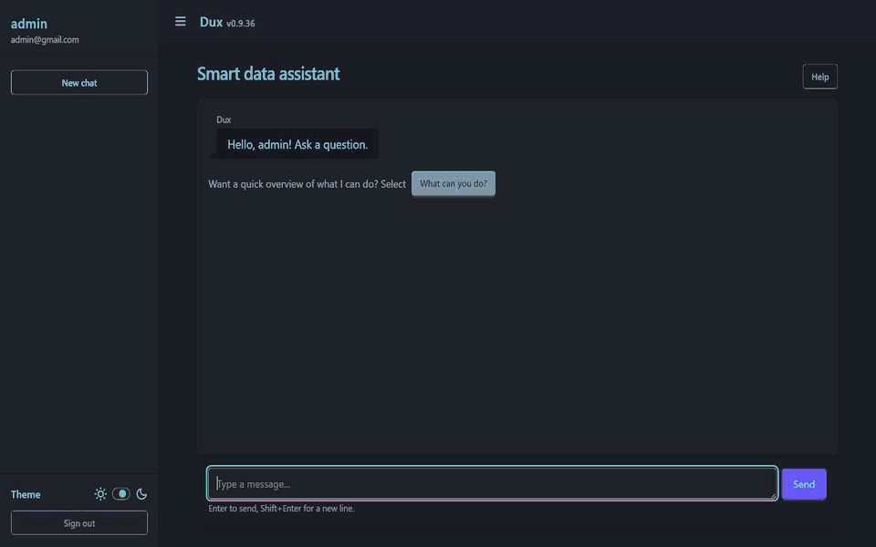
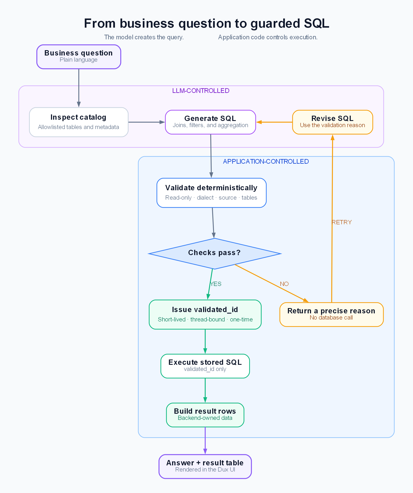

<div align="center">
<pre>
██████╗  ██╗   ██╗ ██╗  ██╗
██╔══██╗ ██║   ██║ ╚██╗██╔╝
██║  ██║ ██║   ██║  ╚███╔╝
██║  ██║ ██║   ██║  ██╔██╗
██████╔╝ ╚██████╔╝ ██╔╝ ██╗
╚═════╝   ╚═════╝  ╚═╝  ╚═╝
</pre>
</div>

# Dux SQL Agent

Dux SQL Agent is a guarded natural-language-to-SQL application for developers who want flexible AI-generated queries
while keeping database authority in application code. It ships with a Django chat UI powered by Datastar, a runnable
Chinook demo, and support for allowlisted SQLite, ClickHouse, and Microsoft SQL Server sources.

The model composes the read-only SQL each question requires. Deterministic, tested code approves the query before
execution.

<p align="center">
  
</p>

## The LLM writes SQL. Code decides if it runs.

Prompts guide query generation. Every generated query then crosses a backend-owned validation boundary. The backend:

- enforces read-only SQL and parses it with a configured dialect
- resolves the query to exactly one source and its table allowlist
- derives the source, dialect, normalized SQL, and table set
- issues a short-lived, thread-bound, one-time `validated_id`
- executes the stored query once by `validated_id`
- builds result rows for the model to explain

Dux can produce a new query for each question. Ordinary, reviewable Python code enforces the limits.

<details>
<summary><strong>See the guarded SQL flow</strong></summary>

<p align="center">
  
</p>

</details>

## Quickstart

Choose either Docker or native Python. You only need one path to set up and run Dux.

First, clone the repository and create your local environment file:

```console
git clone https://github.com/igorsimb/dux.git
cd dux
cp .env.example .env
```

Next, [create an OpenAI API key](https://platform.openai.com/api-keys), open `.env`, and set it explicitly:

```dotenv
OPENAI_API_KEY=your-api-key-here
```

Keep the key private and do not commit your populated `.env` file. Then continue with Docker or native Python.

### Docker (recommended)

```console
docker compose run --rm --build web python manage.py setup --noinput
docker compose up
```

Open `http://localhost:8012` and sign in with:

```text
Email: admin@test.com
Password: password321
```

### Native Python

Python 3.13 is required. On Windows PowerShell:

```powershell
python -m venv .venv
.venv\Scripts\Activate.ps1
python -m pip install -r requirements.txt
python manage.py setup --noinput
python manage.py runserver
```

On macOS or Linux:

```console
python3 -m venv .venv
source .venv/bin/activate
python -m pip install -r requirements.txt
python manage.py setup --noinput
python manage.py runserver
```

Open `http://127.0.0.1:8000` and use the same development credentials shown above.

The `setup` command applies migrations and creates the initial administrator. It is safe to run again and will not
replace an existing administrator or reset its password. Omit `--noinput` to create the administrator interactively:

```console
python manage.py setup
```

The default secret key and administrator credentials are for local development only. Before deploying Dux, set a
unique `DJANGO_SECRET_KEY` and provision secure administrator credentials.

## Go deeper

Want to connect your own database, extend the catalog, or inspect the validation architecture? Start with the
[documentation](docs/README.md).

## License

See [LICENSE](LICENSE).
